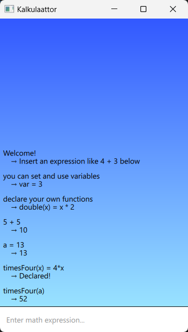

# Kalkulaattor



## Features
- Calculates usual stuff eg. 5*sin(1+2)
- Results can be saved to variables
- User defined functions

## How to setup and run in dev. env.
```bash
python -m venv .venv
source .venv/Scripts/activate
pip install -r requirements.txt

python src/main.py
```
### Run tests
```bash
cd src
python -m unittest
```
